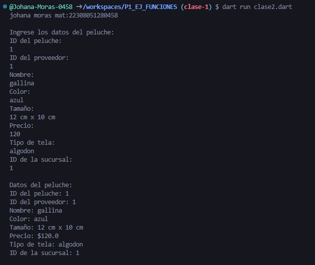
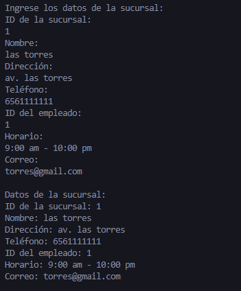
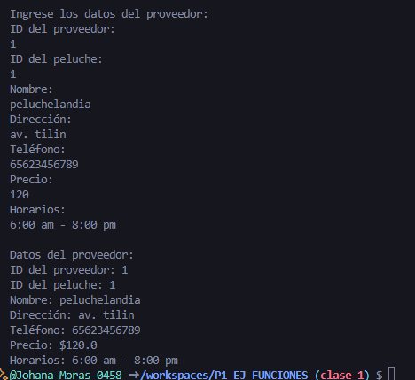

crear: 
clase peluche con 7 atributos (id_peluche;id_proveedor,nombre,color,tamaño,precio,tipo de tela,id_sucursal)
clase sucursal con 7 atributos (id_sucursal,nombre,direccion,nombre,telefono,id_empleado,horario,correo) 
clase llamada proveedor con 7 atributos(id_proveedor,id_peluche,nombre,direccion,telefono,precio,horarios) 
cada clase tiene que tener una funcion de capturardatos () otra de mostradatos(), crear instancia y utilizar los atributos y llamadas a funciones en lenguaje dart 
--johana moras martinez 6-I mat:22308051280458

