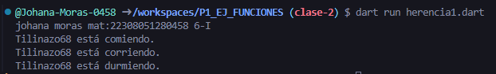

crear una clase animal con los atributos (id_animal,nombre y raza) y una función comer()
crear otra clase perro con herencia animal  con las funciones correr() y otra dormir() en lenguaje dart

--johana moras martinez 6-I mat:22308051280458--

salida de resultados

