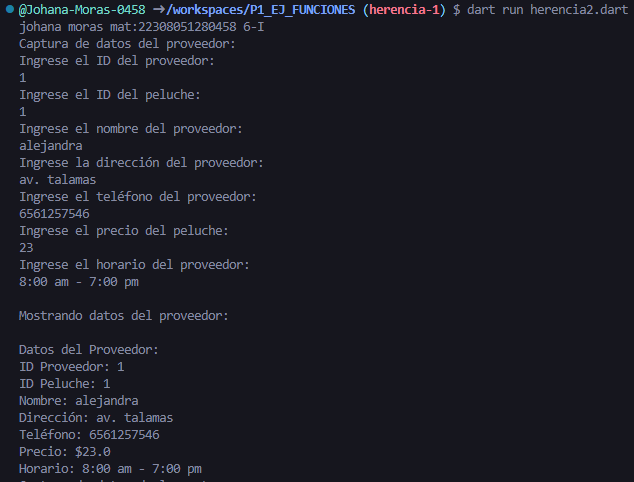
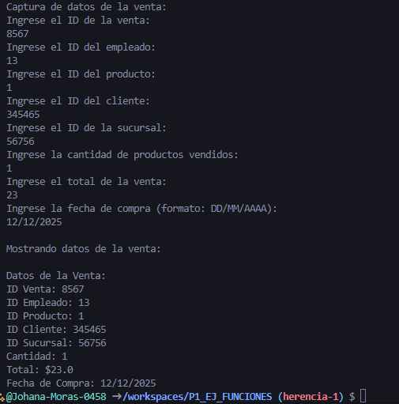

*crear la clase proveedor con los atributos (id_proveedor,id_peluche,nombre,direccion,telefono,precio,horario) con una funcion capturarDatos() con interaccion de interfaz de usuario. crear la clase DatosProveedor con herencia proveedor y una funcion mostrardatos()
*crear una clase venta con los atributos (id_venta,id_empleado,id_producto,id_cliente,id_sucrusal,cantidad total, fechadecompra) con una  con una funcion capturarDatos() con interaccion de interfaz de usuario. crear la clase DatosVenta con herencia venta y una funcion mostrardatos()

--johana moras mat:22308051280458 6-I--

salida de resultados

