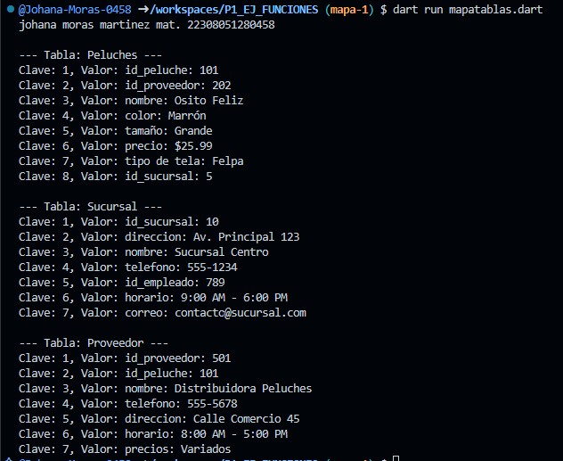

-- crear map <int, string> peluche con los siguientes key , id_peluche,id_proveedor, nombre,color,tamañoprecio, tipo de tela, id_sucursal, mostrar los datos con un forearch en lenguaje dart 

-- crear map <int, string, char> sucursal con los siguientes key , id_sucursal,direccion, nombre,telefono,id_empleado, horario, correo, mostrar los datos con un forearch en lenguaje dart

-- crear map <int, string> proveedor con los siguientes key , id_proveedor,id_peluche, nombre,telefono,direccion, horario, precios, mostrar los datos con un forearch en lenguaje dart

salida de resultados de cada taba  --johana moras martinez mat: 22308051280458--

